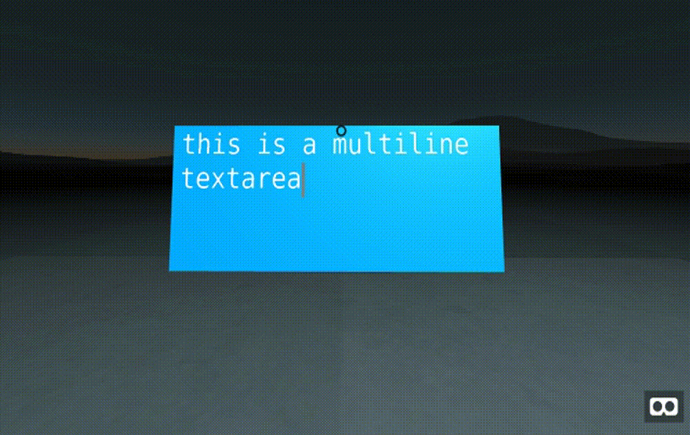

## aframe-textarea-component

[](https://npmjs.org/package/aframe-textarea-component)
[](https://npmjs.org/package/aframe-textarea-component)

A Textarea component for [A-Frame](https://aframe.io).

### Examples

- [Basic Example](https://brianpeiris.github.io/aframe-textarea-component/examples/basic/)



### Todo

(pull requests are welcome!)

- Word-wrap support
- Proportional font support

### API

| Property | Description | Default Value |
| -------- | ----------- | ------------- |
| cols            | number of columns in the textareai  | 40    |
| rows            | number of rows in the textarea      | 20    |
| color           | color of the text                   | black |
| backgroundColor | color of the background             | white |
| text            | default text in the textarea        | ''    |

### Installation

#### Browser

Install and use by directly including the [browser files](dist):

```html
<head>
  <title>My A-Frame Scene</title>
  <script src="https://aframe.io/releases/0.7.0/aframe.min.js"></script>
  <script src="https://unpkg.com/aframe-textarea-component/dist/aframe-textarea-component.min.js"></script>
</head>

<body>
  <a-scene>
    <a-entity textarea></a-entity>
  </a-scene>
</body>
```

<!-- If component is accepted to the Registry, uncomment this. -->
<!--
Or with [angle](https://npmjs.com/package/angle/), you can install the proper
version of the component straight into your HTML file, respective to your
version of A-Frame:

```sh
angle install aframe-textarea-component
```
-->

#### npm

Install via npm:

```bash
npm install aframe-textarea-component
```

Then require and use.

```js
require('aframe');
require('aframe-textarea-component');
```
